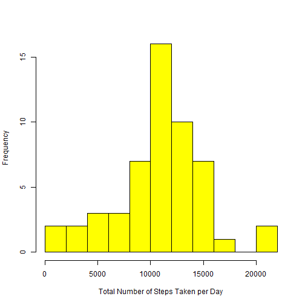
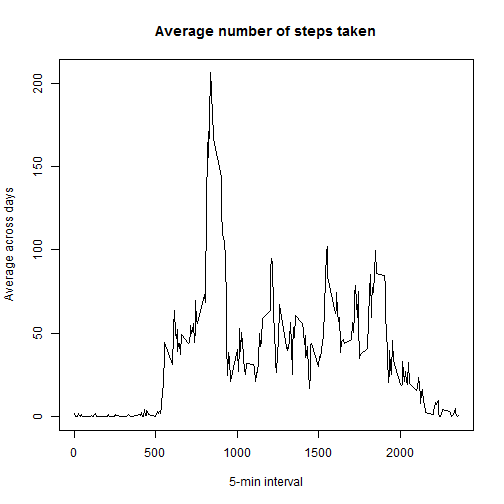
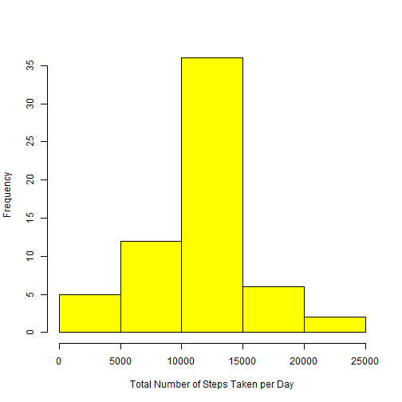
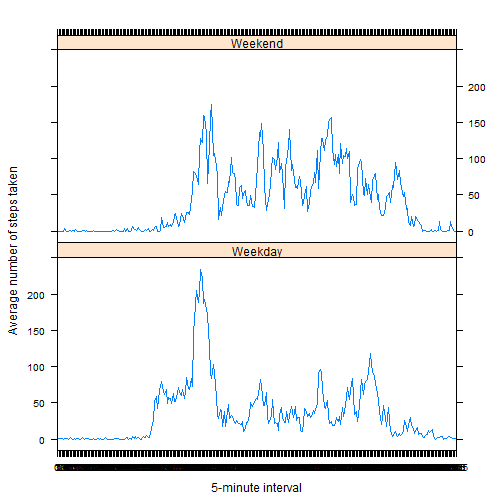

## Loading and preprocessing the data

```r
#Unzip and read data
reqdata <- read.csv(unz("activity.zip", "activity.csv"), header = TRUE, sep = ",",
                  colClasses=c("numeric", "character", "numeric"))
# Format date column values as dates
reqdata$date <- as.Date(reqdata$date, format = "%Y-%m-%d")
# Convert the interval field into Factor class
reqdata$interval <- as.factor(reqdata$interval)
```


## What is mean total number of steps taken per day?

```r
# Aggregate steps taken per day
stepsTakenPerDay <- aggregate(steps ~ date, reqdata, sum, na.rm = TRUE)

# Create a histogram of the total number of steps taken each day
hist(stepsTakenPerDay$steps, 
     main = " ",
     breaks = 10,
     xlab = "Total Number of Steps Taken per Day",
	 col = "yellow")
```

 

```r
# Calculate the mean of the total number of steps taken per day
mean(stepsTakenPerDay$steps, na.rm=TRUE)
```

```
## [1] 10766.19
```

```r
# Calculate the median of the total number of steps taken per day
median(stepsTakenPerDay$steps, na.rm=TRUE)
```

```
## [1] 10765
```

## What is the average daily activity pattern?

```r
# Make the time series...
timeSeries <- tapply(reqdata$steps, reqdata$interval, mean, na.rm = TRUE)
# ...and then plot it
plot(row.names(timeSeries), timeSeries, type = "l", xlab = "5-min interval", 
    ylab = "Average across days", main = "Average number of steps taken", 
    col = "black")
```

 

```r
# Get which 5-minute interval, on average across all the days in the dataset, contains the maximum number of steps
which.max(timeSeries)
```

```
## 835 
## 104
```

## Imputing missing values

```r
# Calculate the total number of missing values in the dataset 
sum(is.na(reqdata))
```

```
## [1] 2304
```

```r
# Aggregate steps taken per interval
stepsAverage <- aggregate(steps ~ interval, reqdata, mean)
# Fill missing values in the dataset (using the mean for that 5-minute interval)
fillNas <- numeric()
for (idx in 1:nrow(reqdata)) {
    measurement <- reqdata[idx, ]
    if (is.na(measurement$steps)) {
        steps <- subset(stepsAverage, interval == measurement$interval)$steps
    } else {
        steps <- measurement$steps
    }
    fillNas <- c(fillNas, steps)
}
# Create a new dataset that is equal to the original dataset but with the missing data filled in
clonedReqdata <- reqdata
clonedReqdata$steps <- fillNas
# Make a histogram of the total number of steps taken each day
stepsTakenPerDayNoNas <- aggregate(steps ~ date, clonedReqdata, sum, na.rm = TRUE)
hist(stepsTakenPerDayNoNas$steps, main = "", xlab = "Total Number of Steps Taken per Day", col = "yellow")
```

 

```r
# Calculate the mean total number of steps taken per day
mean(stepsTakenPerDayNoNas$steps)
```

```
## [1] 10766.19
```

```r
# Calculate the median total number of steps taken per day
median(stepsTakenPerDayNoNas$steps)
```

```
## [1] 10766.19
```

```r
print("The mean value is the same as for the calculation considering the NA values for the steps taken by day.")
```

```
## [1] "The mean value is the same as for the calculation considering the NA values for the steps taken by day."
```

```r
print("The median value is a little bit greater than the one calculated considering the NA values for the steps taken by day. It matches the mean value.")
```

```
## [1] "The median value is a little bit greater than the one calculated considering the NA values for the steps taken by day. It matches the mean value."
```

```r
print("No particular impact of imputing missing data on the estimates of the total daily number of steps.")
```

```
## [1] "No particular impact of imputing missing data on the estimates of the total daily number of steps."
```


## Are there differences in activity patterns between weekdays and weekends?

```r
# Create a new factor variable in the dataset with two levels – "weekday" and "weekend" indicating whether a given date is a weekday or weekend day
Sys.setlocale("LC_TIME", "English")
```

```
## [1] "English_United States.1252"
```

```r
day <- weekdays(reqdata$date)
dayLevel <- vector()
for (dataIdx in 1:nrow(reqdata)) {
    if (day[dataIdx] == "Saturday" | day[dataIdx] == "Sunday") {
        dayLevel[dataIdx] <- "Weekend"
    } else {
        dayLevel[dataIdx] <- "Weekday"
    }
}
reqdata$dayLevel <- dayLevel
reqdata$dayLevel <- factor(reqdata$dayLevel)
stepsByDay <- aggregate(steps ~ interval + dayLevel, reqdata, mean)
# names(stepsByDay) <- c("interval", "daylevel", "steps")

# Make a panel plot containing a time series plot (type = "l") of the 5-minute interval (x-axis) and the average number of steps taken, averaged across all weekday days or weekend days (y-axis)
library(lattice)
p <- xyplot(steps ~ interval | dayLevel, stepsByDay, type = "l", layout = c(1, 2), 
    xlab = "5-minute interval", ylab = "Average number of steps taken",
	drop.unused.levels = lattice.getOption("drop.unused.levels"))
print(p)
```

 
